Fun Times Maths Around is a cross platform application that utilizes the Flutter framework which uses the Dart programming language.  It uses Firebase for the database and authentication.  This project has two main modes which are the Learn Mode and Benchmark mode.  Learn mode is a good way for young children learn the basics of math with tutorials through videos and interactive demos. Children can watch tutorial videos to help them understand the basics of math. They can use these videos to learn how to count, sing along to learn math terminologies, and various other videos to help them expand their knowledge in math.  The Benchmark mode requires a sign in from the user to allow the application to remember their rank.  On creation of the account, the user is prompted to take a short placement quiz to determine their rank.  After their placement quiz, the user can play as many benchmarks as they want with each game affecting their rank.  Their rank will go up and down depending on how many they get right or wrong.  The higher the rank, the harder the problems get. After completing the benchmark, the user is displayed the results page.  This is where the user can see how many questions they got correct, time spent on quiz, and the new rank after taking the quiz.
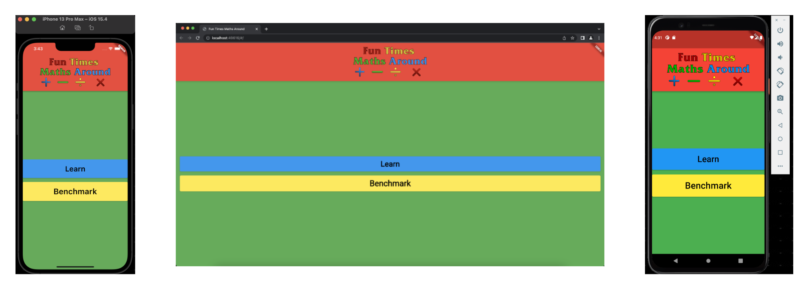

# Demo Video: https://youtu.be/AYWpGQjEDd8

# Code Structure
The project is using the design pattern Model-View-Viewmodel (MMVM).  The project is organized into five separate folders inside the lib folder except the main.dart which is not inside a folder in the lib folder.  The five folders inside the lib folder hold the majority of the code written inside the project with the exclusion of editing of the premade files Flutter generated.  Three of the five folders are used to organize the main parts of the application which are Benchmark, Learn, and SignIn.  The other two folders are MyModels and utils which hold the models and utils for the application.
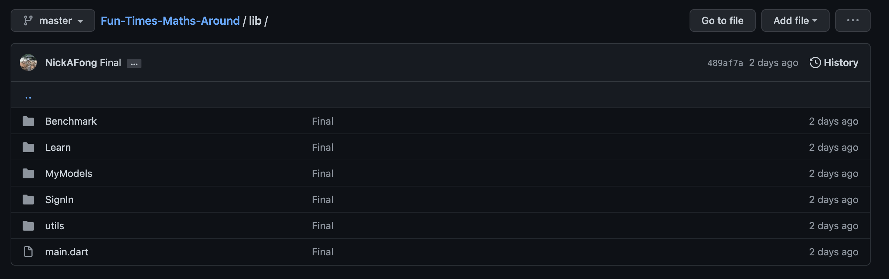

# Setup/Build Instructions (IOS Only)
This setup is for the IOS version of the application and also works out of the box with Android but requires different steps.  The web version requires different configurations to the .yaml file and web folder which are not included in this repository.

Requirements:  
-MacOS  
-Visual Studio Code (w/ Flutter (2.10.3) and Dart extension installed)  
https://code.visualstudio.com/download  
-XCode for the simulator(Preferably IOS 15.2 installed using the iPhone 13 Max Pro. During the development of this project IOS 15.4 came out but had a known problem with the emulator not working correctly)  
-Connect the IOS Simulator with VSCode using the video linked before.  
https://www.youtube.com/watch?v=RmKn7zFivwg&ab_channel=BBuniversalTeam  
-Download of the project using the link below.  
https://github.com/NickAFong/Fun-Times-Maths-Around/archive/refs/heads/master.zip

Step 1  
Unzip the project retrieved from GitHub.  
Start Open up VSCode and click on open folder.  
Select the unzipped folder to open the project.  
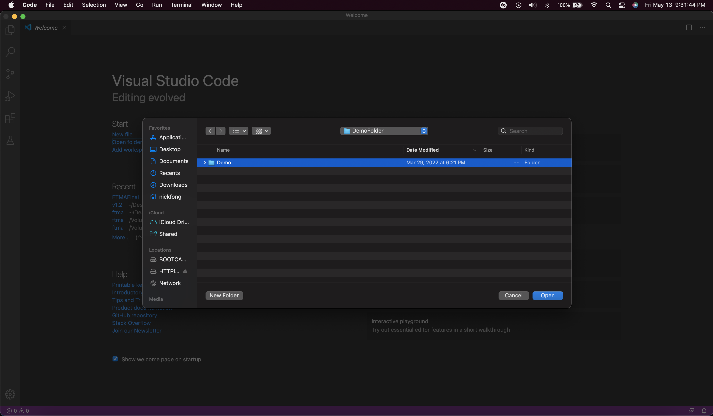

Step 2  
To ensure dependencies are installed locate and open the pubspec.yaml inside VSCode and click on the refresh symbol which is the third symbol from the left at the top right of the screen.
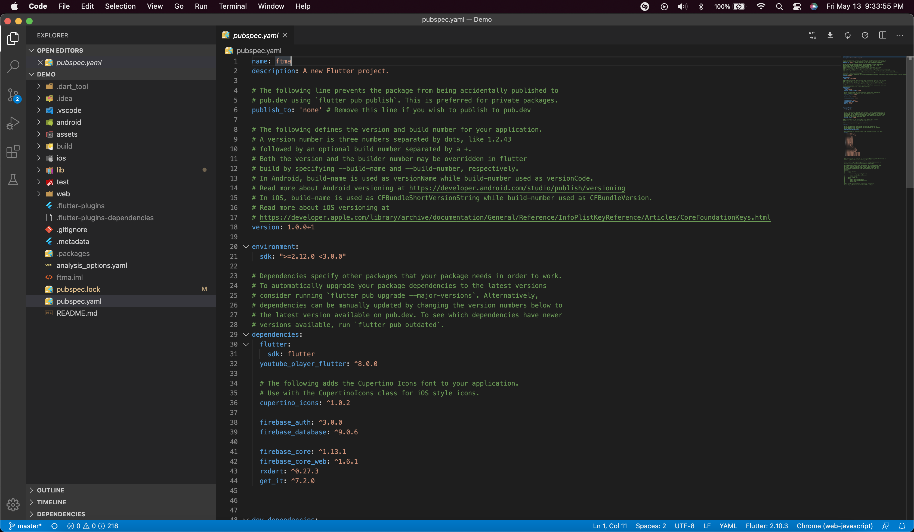
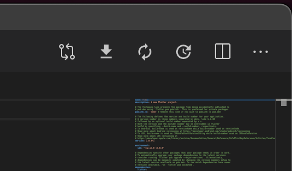
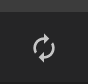

Step 3  
Select the simulator in the bottom right of VSCode and select IOS at the top middle in the command pallet.  Wait for the IOS Simulator to connect...  
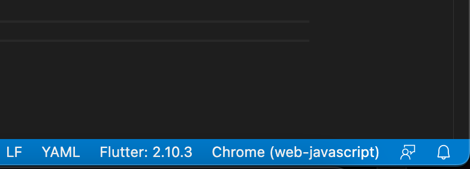
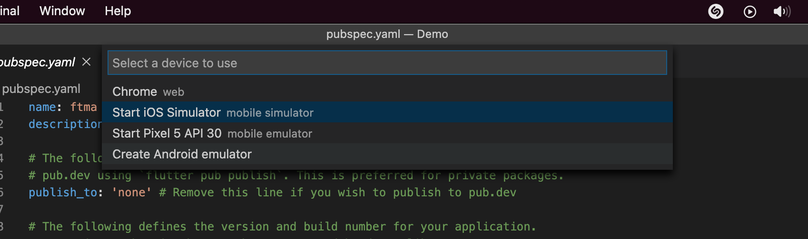

Step 4  
Launch the application by pressing Run in the menu bar of the screen a click on Run Without Debugging.  Alternatively you can use the shortcut Control + F5.
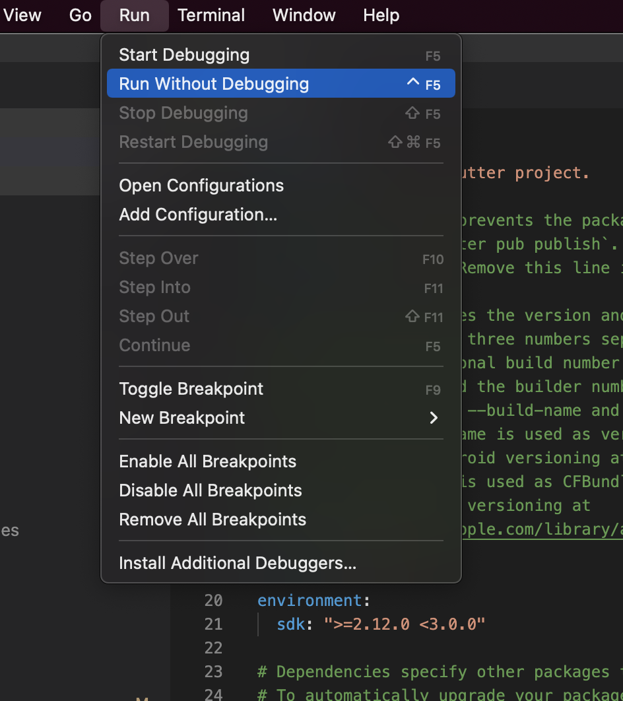
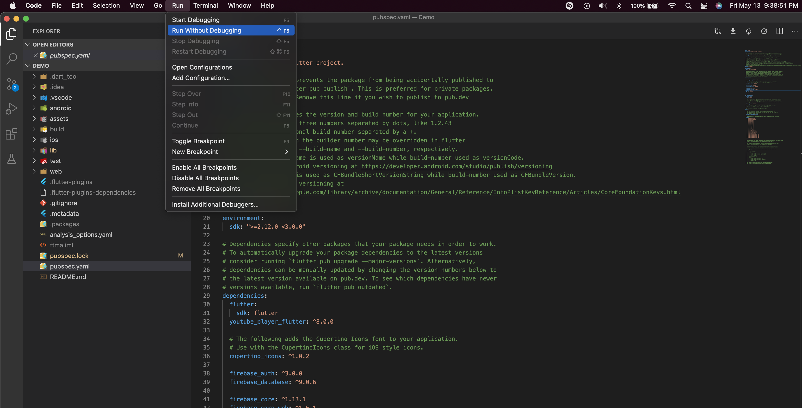

Step 5  
After some time loading, the application will launch in the iOS simulator and will take you to the homepage of the application.
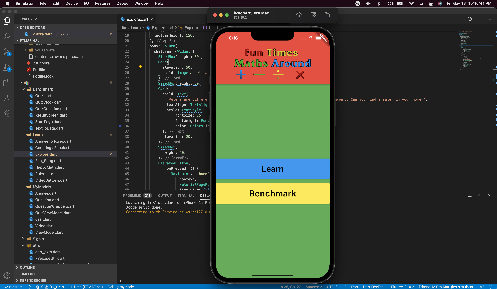

